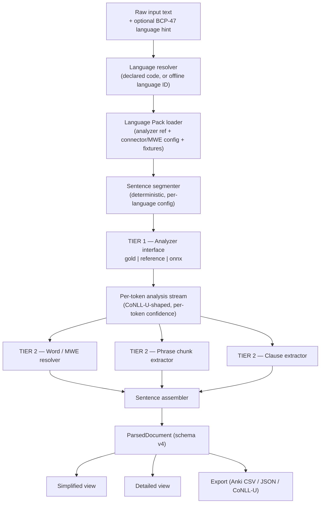

# Historical LangChunk — Plan v4: An Executable Neural-Core / Rule-Layer Hybrid

> This pre-split engineering plan is retained for historical context only. The
> application is now **speechsplitter**; `langchunk` is its separate MIT npm
> dependency. The repository root `README.md` and `LICENSE` supersede any old
> product-name or licensing statements in this document.

## 0. Status of This Document

**Progress: Stages 0–7 complete (2026-08-05), with the caveats in §14.**
Stages 6 and 7 closed on 2026-08-05: the `_generic` broad fallback exists and
degrades honestly, a language is now a **plugin** — a JSON file dropped into a
directory, no rebuild and no release — `packages/export` ships JSON, CoNLL-U,
CSV and Anki, the §7.5.1 MWE dictionary backstop is in and `closed-compound`
and `idiomatic-unit` are emitted for the first time, and the §11.6 correction
loop records and triages reports without ever letting one become evidence.

**Segmentation is measured for the first time (Gate 3, §11.4).** It had none:
Gate 2 holds sentence boundaries constant, so its sentence F1 was 100% *by
construction*. The measurement immediately paid for itself — it settled the
`lowercaseStartsSentence` question the segmenter's own comments had argued in
the abstract, worth **+4.7 boundary F1 for English** and nothing for Russian.
See `reports/segmentation.md`.

**The Russian Tier 1 gap closed substantially on 2026-08-05**: the roadmap's
untried measurement (`syntagrus_pavlov-rubert`) was run in all combinations and
the winner — a mixed pipeline, Taiga tokenizer + ruBERT parser — is now the
default at **75.6 strict clause F1**, up from 68.7 (§V4-63). The same day an
outside review of real Dostoevsky output produced two Tier 2 fixes (the §V4-60
ellipsis rule and the §V4-61 argument-containment clause spans) and an
evidence-backed response: `reports/parser-review-2026-08.md`.

*Earlier status, still true:* Tier 2 exists and
passes both halves of Gate 1 in English and Russian; the pipeline runs end to end
via `langchunk parse`; Gate 2 baselines are recorded in `reports/`. §8 was
rewritten after Stage 2 to describe the repository as it actually is. Stage 3 resolved the plan's biggest open unknown (§6.9) — **in the negative**.
The `ud-goeswith` models were converted, measured, and rejected; Stanza remains
the analyzer. See `reports/stage3-bakeoff.md` and §6.9 below.

**Stages 4–5 took a different shape than this document anticipated**, at the
owner's direction. Rather than a browser that runs the model itself, the product
is a web app talking to a **local service**, with each language downloaded on
demand as a verified pack. The reason is accuracy: running in the browser forces
`OnnxAnalyzer` (87.1 clause F1) where the local service can use Stanza (92.3).
A pack declares its runtime *and* its measured accuracy, and the server picks the
best runtime actually present — so the browser path remains available and simply
loses on merit today. See `.agents/decisions.md` §V4-50..52.

`§14` below still describes the original Stage 4/5. Read it together with
`.agents/roadmap.md`, which reflects what was built.

This is the active implementation plan. It **supersedes** `HybridApproach.v3.md`
(archived in `docs/deprecated/`), which in turn superseded `V2CompletionPlan.md`
and `proposed_plan.md`.

It **does not replace** `ProjectInfo.md`. That remains the product's source of
truth for *what* LangChunk must output. Where this document and `ProjectInfo.md`
appear to disagree, `ProjectInfo.md` wins.

**What v3 got right and this document keeps unchanged:** the diagnosis of why a
rule-only design cannot reach high accuracy (§3), the two-tier thesis (§4), the
UD-relation-to-taxonomy mapping tables (§7.5), the `ParsedDocument` schema shape
(§9), and the worked examples (Appendix A). That analysis was correct and is
carried forward nearly verbatim.

**What this document changes, and why:** v3 was written for a team with a budget.
Its critical path ran through fine-tuning a custom multilingual encoder on pooled
Universal Dependencies data, which requires GPUs, ML expertise, and months of
iteration before anything is testable end-to-end. This version is written for
**one developer, no budget, no team, accuracy as the top priority** — and the
central finding is that those constraints do not require sacrificing accuracy.
They require a different order of operations and a different make-vs-reuse call.

The four structural changes:

1. **Do not train a model.** Suitable pretrained models already exist for English
   and Russian, are permissively licensed, and are small. Converting them is a
   CPU-only afternoon. Training your own would likely be *less* accurate, not
   more (§12).
2. **Test Tier 2 against gold dependency trees.** Universal Dependencies ships
   thousands of hand-annotated trees for free. Running Tier 2 over them isolates
   your code's correctness from the model's error completely, needs no GPU, and
   replaces most hand-annotation labour (§11).
3. **Node and CLI first, browser second.** Node has no bundle budget, so you can
   use a large accurate parser immediately and have a genuinely useful tool
   early. The browser then becomes a size-optimisation exercise against a proven
   pipeline instead of a leap of faith (§7.7, §14).
4. **Pashto is deferred by decision, not by oversight.** English and Russian
   prove the system first. §17 records the full Pashto plan so it can be resumed
   without re-derivation.

**Licensing is resolved.** LangChunk is a personal, open-source, non-commercial
project. Every Universal Dependencies treebank and every pretrained model
referenced here is therefore usable without restriction. Appendix B records the
one-paragraph reasoning and what would have to change if that decision ever
reverses. This removes an entire research workstream from v3.

**Verification status.** §6 records the facts this plan is built on, each marked
verified or unverified as of **2026-08-01**. Claims marked UNVERIFIED are
deliberately load-bearing on nothing — the plan is structured so that if any of
them turns out false, the fallback is already named.

### Table of Contents

1. Executive Summary
2. The Constraints That Shape Everything
3. Diagnosis: Why The Rule-Only Design Hit a Ceiling
4. The Core Architectural Thesis
5. Product Contract (Carried Forward, Unchanged)
6. Verified Ground Truth
7. System Architecture — 7.1 Overview · 7.2 The Analyzer Interface ·
   7.3 Analyzer Implementations · 7.4 Tier 1 Decoding · 7.5 Tier 2 ·
   7.6 Language Pack Contract · 7.7 Runtime & Deployment
8. Repository Structure
9. Data Model (Schema v4)
10. Defining "Linguistically Correct"
11. Evaluation & Quality Assurance
12. Model Acquisition
13. Performance Budgets
14. Implementation Roadmap
15. Multilingual Challenges Crosswalk
16. Risks & Known Hard Cases
17. Pashto: The Deferred Workstream
- Appendix A: Worked Examples
- Appendix B: Licensing
- Appendix C: What Was Cut From v3, And Why

---

## 1. Executive Summary

LangChunk breaks natural-language text into a nested Sentence → Clause → Phrase →
Word structure, offline, in a browser, across many languages.

The architecture is two tiers:

- **Tier 1 — Neural Linguistic Core.** A small transformer produces, per token, a
  UPOS tag, morphological features, and a dependency head + relation. This is the
  genuinely ambiguous, structural part of the problem and it should be learned
  from data, not hand-written.
- **Tier 2 — Deterministic Grammar-to-Taxonomy Layer.** Given a correct
  dependency tree, converting it into LangChunk's Word/Phrase/Clause/Sentence
  taxonomy is a *deterministic transformation*, because the taxonomy is a fixed
  designed scheme rather than an ambiguous natural phenomenon. This is plain
  TypeScript, identical for every language, configured per language only for
  surface details.

The single most important sentence in this plan: **Tier 1 you get for free, Tier
2 is where your unique value is.** Pretrained UD parsers for English and Russian
already exist, published under MIT and Apache-2.0, at 40–126 MB after INT8
quantization. Nobody has built Tier 2 — the mapping from Universal Dependencies
into a learner-facing grammatical taxonomy with traceable spans and honest
confidence. That is the project. Spend your hours there.

The consequence for execution: the highest-value work — Tier 2 — requires **no
model, no GPU, no network, and no money**, because it can be developed and
validated against gold dependency trees that Universal Dependencies distributes
for free. You reach a fully correct, fully tested taxonomy engine before you ever
load a model. Then you attach models to it in three progressively harder steps,
each of which changes exactly one variable.

---

## 2. The Constraints That Shape Everything

Stated plainly, because every decision below follows from them:

| Constraint | Consequence for the plan |
|---|---|
| One developer | No workstream may require parallel effort. Phases are strictly sequential and each ends in something testable. |
| No budget | No paid GPUs, no paid APIs, no paid hosting, no legal review. Free tiers only, and nothing may *depend* on a free tier staying free. |
| No team | No code review, no second opinion on linguistics. The plan compensates with automated gates: property tests over thousands of gold trees catch what a reviewer would. |
| Accuracy is the top priority | Where accuracy and convenience conflict, accuracy wins. This is why Node ships first (no size limit means no accuracy compromise) and why the browser gets the *measured* accuracy delta rather than a hoped-for one. |
| Non-commercial, open-source | All UD treebanks and all referenced models are usable. Appendix B is three paragraphs instead of a research project. |
| Native Pashto speaker | Pashto is uniquely tractable for this project *later* — but it is deferred until English and Russian prove the system works (§17). |

Two anti-goals worth naming, because they are the failure modes this plan is
built to avoid:

- **Do not start with the hardest constraint.** v3's ordering put "fit a
  multilingual model in a browser" before "prove the taxonomy layer is correct."
  If the taxonomy layer is wrong, a perfectly optimised model produces
  perfectly-delivered wrong answers.
- **Do not optimise against fixtures you generated from your own parser.** The
  current `test-data/en/*.json` fixtures do exactly this and consequently report
  100% F1 while encoding real linguistic errors as ground truth (§11.3). This is
  worse than having no fixtures, because it produces confident false signal.

---

## 3. Diagnosis: Why The Rule-Only Design Hit a Ceiling

*(Carried from v3 unchanged. This analysis was correct and remains the
justification for the whole architecture.)*

The existing v2 system uses hardcoded compound word lists plus POS-sequence
pattern matching. The proposed v2 fix — replacing word lists with regex/state
machine patterns over POS tag sequences (`ADJ+ NOUN+` → NP) — only moved the
brittleness up one layer. It quietly assumes the POS tags feeding it are already
correct, and that phrase and clause boundaries are a *linear* property of a tag
sequence. Neither holds:

- **Where do the tags come from?** English tags come from `wink-nlp` (a real if
  lightweight statistical tagger). Russian tags come from `caseHeuristics.mjs`,
  which is rule-based. Pashto is rule-heavy and explicitly low-confidence. Tagging
  quality already varies from decent to weak *before* the chunking step. The
  brittleness did not start at chunking; it was already present one step earlier.

- **Phrase and clause boundaries are not linear.** Prepositional-phrase
  attachment, relative clause boundaries, and coordinator scope are *structural*
  facts — they depend on which token attaches to which, not on the tag sequence
  read left to right. `ADJ+ NOUN+` = NP breaks the moment modifiers are
  discontinuous, a clause interrupts a phrase, or word order shifts (constantly,
  in Russian). No quantity of additional patterns fixes this; it is the same
  whac-a-mole the project already recognised for compound words, recurring one
  level up.

- **Clause identification requires knowing "who is the subject of which
  predicate."** That is a *relational* fact between two tokens, not a taggable
  property of either alone. No POS-sequence rule expresses it correctly in
  general. A dependency graph expresses it directly and correctly by
  construction.

**This is not hypothetical — it is observable in the current code.**
`packages/@langchunk/lang-base/src/BaseParser.mjs` implements exactly the
rejected approach: `consumePhrase()` (line 224) is a linear left-to-right UPOS
run; `findClauseStarts()` (line 284) detects clauses by scanning for connector
keywords; `findSubject()` (line 397) walks backwards from the predicate looking
for the nearest `PRON|NOUN|PROPN`. Each is a reasonable heuristic and each fails
on the constructions above.

---

## 4. The Core Architectural Thesis

*(Carried from v3 unchanged.)*

**Make the ambiguous, structural part of the problem the job of a statistical
model. Make the well-defined, designed part of the problem the job of
deterministic rules.**

Dependency parsing under Universal Dependencies — a mature formalism covering
193 languages — already produces exactly the information LangChunk's taxonomy
needs:

| LangChunk needs to know... | UD already encodes this as... |
|---|---|
| Is this a multi-word lexical unit? | `compound`, `flat`, `fixed`, `goeswith` relations between tokens |
| What are this phrase's boundaries and type? | A token's subtree of non-clausal dependents (`det`, `amod`, `obj`, `case`, …) |
| Where does this clause start and end? | A predicate's subtree, cut at clause-introducing relations |
| Is this clause independent, coordinated, or dependent — and how? | `conj`+`cc` (coordination); `advcl`/`acl`/`acl:relcl`/`ccomp`/`csubj` (subordination), each with an explicit label |
| What is the connector, and where does the boundary fall? | `mark` (subordinators), `cc` (coordinators), or a relativizer heading `acl:relcl` |

Once Tier 1 hands over a correct dependency tree, **Tier 2's job is
re-expression, not disambiguation.** The hard ambiguity has already been
resolved. Tier 2 walks the resolved tree and relabels it into LangChunk's
vocabulary — a stable, language-general algorithm, parameterised per language
only for surface details.

**What this buys, mapped to the project's five stated goals:**

- *Highly accurate* — structure comes from a trained model that generalises to
  unseen text, not from an ever-growing pattern list.
- *Multilingual* — the same Tier 2 algorithm runs for every language.
- *Extensible* — a new dedicated language is config + fixtures, not a new parser.
- *Lightweight* — Tier 2 is dependency-free TypeScript running in microseconds;
  Tier 1 is a small model loaded lazily per language.
- *Offline-first* — the whole pipeline runs locally; no text ever leaves the
  device.

---

## 5. Product Contract (Carried Forward, Unchanged)

Compressed restatement of `ProjectInfo.md`, so this document is self-contained.
If anything here appears to narrow the original intent, `ProjectInfo.md` wins.

**Output levels**, nested: Sentence → Clause(s) → Phrase(s) → Word(s).

- **Word** — the smallest independent meaningful unit, including multi-word
  lexical units: open compounds (*ice cream*, *high school*), hyphenated
  compounds (*mother-in-law*), closed compounds (*smartphone*), and idiomatic
  units (*check-in*, *breakup*).
- **Phrase** — two or more words functioning as one unit, without both a subject
  and predicate. Types: NP, VP, PP, AdjP, AdvP.
- **Clause** — has a subject and a predicate. Independent, coordinated, or
  dependent.
- **Sentence** — the largest independent grammatical unit; contains at least one
  independent clause.

**UX** — a simplified mode (sentences → clauses → unique word list, punctuation
excluded) and a detailed mode (+ phrases, phrase types, clause types,
language-specific notes, uncertainty indicators).

**Output principles** — never rewrite the user's text; every unit traceable to an
exact span in the original; one parsed result supporting multiple views; expose
uncertainty rather than hide it; prefer useful output over perfect theory.

**Product goals** — offline-first (privacy: input may be personal, copyrighted,
religious, political, or private), multilingual (100+ broad, 11+ dedicated as a
long-term target with graceful fallback), highly accurate, lightweight,
extensible.

**Non-goals** — not a translator, dictionary, grammar corrector, chatbot,
summariser, or explanation engine.

**Reference clause examples** named explicitly in `ProjectInfo.md`, used as
validation data in Appendix A: *"I go to the market every day"*, *"and buy fresh
vegetables"*, *"where my children play"*, *"When the weather is nice"*, *"we sit
outside"*, *"and watch the birds"*, *"while talking about our lives"*, *"that her
daughter is getting married next month."*

---

## 6. Verified Ground Truth

This section exists so no future session re-researches these facts, and so that
anything unverified is visibly unverified. **Verified 2026-08-01.** Re-check
before acting on anything older than a few months.

### 6.1 Pretrained models — the finding that removes the training workstream

A family of 62 models by Koichi Yasuoka (`*-ud-goeswith`) performs dependency
parsing as genuine token classification. Architecture confirmed as
`RobertaForTokenClassification` / `ModernBertForTokenClassification` in
`config.json`. Labels are `UPOS|FEATS|DEPREL` strings, e.g. `ADJ|Degree=Cmp|amod`
— exactly the three outputs Tier 2 needs.

| Model | fp32 | INT8 (est.) | Labels | License |
|---|---|---|---|---|
| `KoichiYasuoka/roberta-base-english-ud-goeswith` | 504 MB | ~126 MB | 2,561 | MIT |
| `KoichiYasuoka/roberta-large-english-ud-goeswith` | 1,429 MB | ~357 MB | — | MIT |
| `KoichiYasuoka/modernbert-small-russian-ud-goeswith` | 160 MB | **~40 MB** | 13,946 | Apache-2.0 |
| `KoichiYasuoka/modernbert-base-russian-ud-goeswith` | 641 MB | ~160 MB | 13,946 | Apache-2.0 |

Coverage spans 16 languages. English: yes. Russian: yes. **Persian: no. Pashto:
no.**

INT8 sizes are arithmetic (fp32 ÷ 4), **not measured** — confirm during Stage 3.

A third-party ONNX export already exists (`ghotriw/roberta-base-english-ud-goeswith-onnx`,
MIT, fp32 only, 504 MB, no quantized variant) — proof the export path works, not
a shortcut you can ship.

### 6.2 How these models decode — the critical detail

**This is not one forward pass per sentence.** Verified by reading `ud.py` in the
model repo: for an N-token sentence the pipeline constructs a **batch of N
sequences**, each being the sentence with token *i* replaced by `[MASK]` and
token *i* appended at the end. That produces an N×N arc-score matrix, decoded
with **Chu-Liu-Edmonds** maximum spanning tree.

Consequences the plan must absorb:

- Compute is **O(N²) in sentence length**, not O(N). One ONNX call with batch
  size N and sequence length ≈ N. The batch axis is dynamic in Optimum's exporter
  config (verified), so this is a single batched call, not N sequential calls —
  but the total token-positions processed is N².
- **v3's "per-token argmax plus a simple repair pass" is wrong.** You need a real
  MST decoder. Chu-Liu-Edmonds is roughly 30 lines of TypeScript. Write it in
  Stage 1 and unit-test it against known inputs, where it costs nothing.
- The published method is Yasuoka, ICBIR 2023.

A sibling family (`ud-embeds`, 61 models) uses single-forward-pass
direction-encoded labels (`l-case`, `r-nsubj`, `root`) but feeds `inputs_embeds`
over an O(N²)-length sequence — a non-standard ONNX export path. **Prefer
`ud-goeswith`**; keep `ud-embeds` as a documented fallback if O(N²) latency
proves fatal.

### 6.3 transformers.js cannot run this

Verified against the official pipeline task list: there is no
`universal-dependencies` task and no `trust_remote_code` support. **You must
reimplement the decoding logic in TypeScript** — roughly 60 lines for mask-batch
construction and label masking, plus ~30 for Chu-Liu-Edmonds. This is a known,
bounded work item, scheduled in Stage 1.

Calling the plain `token-classification` pipeline against these models yields
UPOS and FEATS but **no dependency heads at all**. Any tutorial suggesting
otherwise is wrong.

### 6.4 Model size reality — "tens of MB" was optimistic

INT8 ≈ fp32 ÷ 4. Embedding column = vocab × hidden, from real `config.json`
values:

| Model | fp32 | INT8 | Embeddings @INT8 | emb % |
|---|---|---|---|---|
| Multilingual-MiniLM-L12-H384 | 471 MB | 118 MB | 96 MB | **82%** |
| mmBERT-small | 564 MB | 141 MB | 98 MB | 70% |
| XLM-RoBERTa-base | 1,116 MB | 279 MB | 192 MB | 69% |
| mmBERT-base | 1,231 MB | 308 MB | 197 MB | 64% |
| *roberta-base-english-ud-goeswith* | 504 MB | **126 MB** | 39 MB | 31% |
| *modernbert-small-russian-ud-goeswith* | 160 MB | **40 MB** | 19 MB | 48% |

**A genuinely multilingual encoder floors at ~120–140 MB INT8**, of which 58–82%
is the vocabulary embedding table. "Tens of MB" is achievable only per-language
with a small vocab — which is precisely what the `ud-goeswith` English and
Russian models are.

Two levers follow, both CPU-only:

- **Vocabulary trimming.** Keep only embedding rows for tokens your target
  language actually uses, remap IDs, adjust the tokenizer. No retraining, because
  a token-classification model has no output vocabulary. Highest-leverage size
  reduction available: trimming a 256k vocabulary to ~32k takes a 98 MB INT8
  embedding table to roughly **12 MB** — an ~8× cut on the single largest
  component of the model.
- **Per-language models, loaded lazily.** Already the shape of what exists.

Second constraint v3 did not account for: **the label set grows with
morphology.** English 2,561 labels → Russian 13,946 → a 5-language Scandinavian
model 19,771. At hidden size 768 the Russian classifier head alone is ~15 MB at
INT8.

### 6.5 mmBERT — real, but commits you to training

`jhu-clsp/mmBERT-base` (307M params, vocab 256,000, MIT) and
`jhu-clsp/mmBERT-small` (140M) are real, published by JHU CLSP in September 2025,
arXiv 2509.06888, trained on 3T+ tokens across 1,800+ languages.

**However: zero UD/dependency fine-tunes of mmBERT exist on the Hub.** Naming it
as the base encoder — as v3 did — therefore *commits you to fine-tuning*. It is
the right choice for the eventual joint multilingual model (§17.3) and the wrong
choice for shipping something this year.

Existence proof that the joint approach works:
`KoichiYasuoka/modernbert-base-scandinavian-ud-embeds` covers five Scandinavian
languages in one model, built on an mmBERT-derived base, and its `maker.py` is
the complete public recipe.

### 6.6 Universal Dependencies (v2.18, released 2026-05-15 — 353 treebanks, 193 languages)

| Treebank | Tokens | Sentences | License |
|---|---|---|---|
| English-EWT | 251,491 | 16,622 | CC BY-SA 4.0 |
| English-GUM | 252,284 | — | CC BY-NC-SA 4.0 |
| English-CHILDES | 289,817 | — | CC BY-SA 4.0 |
| Russian-SynTagRus | 1,515,559 | 87,337 | CC BY-NC-SA 4.0 |
| Russian-Taiga | 1,758,937 | 121,967 | CC BY-SA 4.0 |
| Persian-PerDT | 494,163 | 29,107 | CC BY-SA 4.0 |
| Persian-Seraji | 151,627 | 5,997 | CC BY-SA 4.0 |
| **Pashto-Sikaram** | **5,421** | **200** | CC BY-SA 4.0 |
| **Pashto-Prince** | **1,180** | **64** | CC BY-SA 4.0 |

**Pashto totals 6,601 tokens across both treebanks, test-split only, with no
train file in either repository.** No parser can be trained on it. Pashto is
absent from Trankit, Stanza, spaCy, and all 961 UDPipe models. This is the hard
data fact behind §17.

*Provenance note:* a first research pass found only `UD_Pashto-Prince` and
reported 1,180 tokens. A second pass confirmed via the GitHub API
(`search/repositories?q=org:UniversalDependencies+pashto` → `total_count: 2`)
that `UD_Pashto-Sikaram` also exists and is 4.6× larger. **The 6,601 figure is
the corrected one.** Recorded because the conclusion — Pashto is untrainable —
holds under either number, but the corrected figure is what §17 plans against.

License mix across all 353 treebanks: 78.2% CC BY-SA, 17.3% non-commercial,
3.1% permissive, 1.4% other. NC is 17% by treebank count but **37% by token
volume** — the largest corpora are disproportionately NC. Irrelevant given
Appendix B, but recorded in case that decision reverses.

Full download: `ud-treebanks-v2.18.tgz`, **684 MB**, from LINDAT
`hdl.handle.net/11234/1-6149`. Per-treebank Git repositories exist under the
`UniversalDependencies` GitHub organisation (477 repos — use `master`, not
`dev`). **You only need two treebanks to start (English-EWT, Russian-Taiga),
roughly 30 MB.** Do not download the full archive.

### 6.7 Reference parser — use Stanza

|  | Trankit | **Stanza** | spaCy + spacy-udpipe | UDPipe 2 |
|---|---|---|---|---|
| Latest | 1.1.2, Oct 2024 | **1.14.0, Jul 2026** | plugin stale (2021) | Nov 2025 |
| Install | **pip broken** | clean | plugin stale | not a library |
| Model size | ~1.15 GB | **334 MB** | 11 MB | 8.8 GB |
| CPU speed | ~411 tok/s | **~790 tok/s** | ~1000 w/s | ~60 w/s |
| Code license | Apache-2.0 | Apache-2.0 | MIT | MPL-2.0 |
| Model license | none stated | ODC-By 1.0 (hedged) | CC BY-NC-SA 4.0 | CC BY-NC-SA 4.0 |
| UD output | yes | **yes, documented** | udpipe yes; spaCy English is *not* UD | yes |

Trankit — which v3 recommended — is **1.9× slower than Stanza on CPU** (its
efficiency claim is about GPU), states no model license anywhere, and its README
carries a live warning that pip installation is broken. **Use Stanza.**

Note the trap: HuggingFace cards for `stanfordnlp/stanza-*` declare
`apache-2.0`, which contradicts Stanza's own documentation (ODC-By, with an
explicit hedge that "license information for models built from the UD data is
unclear"). The card metadata is auto-generated boilerplate. Irrelevant here given
Appendix B; recorded for accuracy.

### 6.8 Free compute — sufficient, if ever needed

Only relevant to §17's deferred work; nothing on the critical path needs a GPU.

- **Colab free tier**: officially "at most 12 hours" per notebook; Google
  explicitly declines to guarantee GPU type or availability. Treat as
  best-effort.
- **Kaggle**: ~30 GPU-hours/week, 12h max session, P100 ×1 or T4 ×2, 32 GB host
  RAM. **PARTIALLY VERIFIED** — kaggle.com serves a bot interstitial, so these
  come from search snippets of official URLs rather than direct reads.

Yasuoka's published `maker.py` hyperparameters for `ud-goeswith`: **3 epochs,
batch 32, lr 5e-5, warmup 0.1.** Estimated ~20 minutes on a T4 for a
single 250k-token treebank. Fine-tuning is cheap when it becomes necessary; it is
simply not necessary now.

### 6.9 Explicitly unverified — RESOLVED 2026-08-02

**The central unknown here was whether the `ud-goeswith` models are accurate
enough. They are not.** Measured through Gate 2 against Stanza:

| | clause | phrase | word |
|---|---|---|---|
| English Stanza / ONNX | 85.4 / **87.1** | **92.8** / 89.8 | **96.5** / 92.5 |
| Russian Stanza / ONNX | **67.1** / 60.5 | **84.2** / 71.5 | **87.9** / 79.8 |

Not the quantization: fp32 and INT8 differ by ~0.2 F1. The cause is structural —
these models emit subword tokens and rebuild words by *predicting* `goeswith`,
so every miss is a wrong word boundary, and words carry everything above them.

**The escalation this section proposed — `roberta-large-english` — is therefore
the wrong response.** The deficit is the word-recovery mechanism, not capacity,
and a larger model of the same family inherits it.

Sizes were also wrong: English INT8 is **232.5 MB** against the 40–126 MB
estimated in §6.4, which was fp32 ÷ 4 arithmetic.

Full report: `reports/stage3-bakeoff.md`. Decisions: `.agents/decisions.md`
§V4-39..42.

#### Original text, for the record


- ONNX export and quantization wall-clock time — no published benchmark found.
- LAS/UAS accuracy figures for the `ud-goeswith` English and Russian models — not
  reported on the model cards. **Stage 3 must measure this directly** rather than
  assume; it is the single most important unknown remaining.
- All INT8 sizes above are arithmetic, not measured.
- Kaggle quota figures (see 6.8).
- Colab free-tier GPU type.

---

## 7. System Architecture

### 7.1 Overview



Note two changes from v3's diagram. Sentence segmentation is **deterministic and
separate**, not folded into the model — the existing rule-based segmenter with
per-language abbreviation lists already works, is cheap, and keeps the model's
job narrower. And Tier 1 is an **interface**, not a model.

### 7.2 The Analyzer Interface

This is the most important structural idea in this document and it did not exist
in v3.

```typescript
/** Everything Tier 2 needs to know about one token. CoNLL-U shaped. */
export interface TokenAnalysis {
  id: number;              // 1-based within sentence, per CoNLL-U convention
  form: string;            // exact surface form
  span: Span;              // offsets into the ORIGINAL document text
  lemma?: string;
  upos: string;            // Universal POS tag
  feats?: Record<string, string>;   // morphological features
  head: number;            // id of head token; 0 means root
  deprel: string;          // dependency relation, e.g. "acl:relcl"
  confidence: number;      // 0–1, per token
}

export interface AnalyzedSentence {
  span: Span;
  tokens: TokenAnalysis[];
}

/** Tier 1. Three implementations, fully interchangeable. */
export interface Analyzer {
  readonly id: string;
  analyze(text: string, lang: string): Promise<AnalyzedSentence[]>;
}
```

Everything downstream of this interface — all of Tier 2, the assembler, the
views, the exports — depends only on `Analyzer`, never on a model. That single
decision produces four properties the plan relies on:

1. **Tier 2 is testable with zero infrastructure.** A gold treebank file
   implements `Analyzer`. No model, no network, no GPU.
2. **Model swaps are safe.** Replacing Stanza with ONNX changes one constructor
   argument. Every test stays valid.
3. **Tier 1 and Tier 2 error are separable.** Run the same fixtures through the
   gold analyzer and the real one; the difference *is* the model's contribution
   to error. Without this you cannot tell whether a bad output is your bug or the
   model's limitation — and with one developer, knowing where to look is the
   scarcest resource you have.
4. **The staged roadmap works.** Each stage swaps exactly one implementation.

### 7.3 Analyzer Implementations

| Implementation | Package | Purpose | Availability |
|---|---|---|---|
| `GoldAnalyzer` | `@langchunk/conllu` | Reads hand-annotated CoNLL-U from a UD treebank. Zero parse error by construction. | Stage 1 — the foundation of all Tier 2 testing |
| `StanzaAnalyzer` | `@langchunk/analyzer-stanza` | Shells out to Python Stanza, caches results to disk. Dev and CLI only; never shipped. | **Built (Stage 2)** |
| `OnnxAnalyzer` | `@langchunk/analyzer-onnx` | ONNX Runtime session + the decoder from §6.2/§6.3. The Chu-Liu-Edmonds half already exists in `@langchunk/grammar`. | Stage 3 (Node) → Stage 4 (browser) |

`GoldAnalyzer` is not a test double. It is a permanent, first-class part of the
system, and the CI gate in §11.1 runs against it forever.

### 7.4 Tier 1 Decoding

Work required in TypeScript, entirely determined by §6.2 and §6.3:

1. **Mask-batch construction.** For an N-token sentence, build N sequences; in
   sequence *i*, replace token *i* with `[MASK]` and append token *i* at the end.
   Submit as one batched ONNX call.
2. **Label decode.** Each output label is a `UPOS|FEATS|DEPREL` string; split it.
   Mask out labels that are structurally impossible at a given position (root
   labels off-root, `goeswith` where it cannot apply).
3. **Arc scoring.** Assemble the N×N score matrix from the per-sequence outputs.
4. **Chu-Liu-Edmonds.** Decode the maximum spanning tree. Guarantees exactly one
   root and no cycles by construction — which is why v3's "argmax plus repair
   pass" is not merely weaker but structurally unable to give the same guarantee.
5. **Confidence.** Per-token confidence from the softmax margin of the chosen
   label; propagate into `TokenAnalysis.confidence`.

Roughly 90 lines total. **Write and unit-test this in Stage 1**, against
handcrafted score matrices with known correct trees, before any model exists.
Debugging a graph algorithm and a model integration simultaneously is exactly the
kind of compound problem a solo developer should refuse to accept.

### 7.5 Tier 2 — Deterministic Grammar-to-Taxonomy Layer

*(Mapping tables carried from v3 unchanged — this is the intellectual core.)*

Given `AnalyzedSentence[]`, deterministically produce Word, Phrase, and Clause
units with spans traceable to the original text and confidence aggregated from
constituent tokens. Plain TypeScript, no model weights, microseconds, **the same
algorithm for every language.**

**7.5.1 Word / multi-word-expression resolution**

1. Start from Tier 1's tokens.
2. Merge tokens connected by `compound`, `flat`, or `fixed` (and `goeswith`, for
   a word erroneously split) into one Word unit. This covers open compounds
   (*ice cream*, *high school*, *post office*) with no hardcoded list, because
   the model recognises the structural pattern.
3. Apply the per-language hyphenation rule (§7.6) to decide whether a hyphenated
   sequence is one token before Tier 1 sees it, or is split and re-merged here.
4. Closed compounds (*smartphone*) need no handling — already one token.
5. **Backstop only:** consult a per-language MWE/idiom dictionary for lexicalised
   units structural relations miss (*check-in*, *breakup*). This is
   `ProjectInfo.md`'s "Dictionary Rule". Source it from open data (Wiktionary-derived
   multi-word entries) rather than hand-authoring. The difference from the old
   approach is that this is a *backstop layered on a generalising model*, not the
   sole mechanism.

**7.5.2 Phrase chunk extraction**

Extract a head token of the matching UPOS category plus its non-clausal
dependents, excluding relations that must become separate Clause units:

| Phrase type | Head UPOS | Included dependents | Excluded (become clauses) |
|---|---|---|---|
| NP | `NOUN`/`PROPN`/`PRON` | `det`, `amod`, `nummod`, `compound`, `flat`, `nmod`, `appos`, possessive `case` | `acl`, `acl:relcl`, `ccomp` |
| VP | `VERB`/`AUX` | `aux`, `aux:pass`, negation (`advmod`/`neg`), `obj`, `iobj`, `xcomp` | `nsubj` (belongs to the clause frame), `advcl`, `ccomp` |
| PP | the nominal governed by an adposition | the adposition itself (attached via `case`) plus the nominal's full non-clausal subtree | — |
| AdjP | `ADJ` | degree `advmod` (*very*) | — |
| AdvP | `ADV` | `advmod` | — |

UD attaches the adposition as a *dependent* of the noun it governs (via `case`),
the reverse of traditional "PP dominates NP". The extractor must assemble the
conventional PP by grouping the case-marking adposition with its governed
nominal's subtree, not by treating the adposition as head.

**Two constraints from `ProjectInfo.md:100` the current v2 code violates and the
new engine must enforce:** a phrase is *two or more words* — a bare pronoun is
not a phrase; and a connector (`mark`, `cc`) is not a phrase of any type. See
§11.3.

**7.5.3 Clause extraction**

| LangChunk clause type | UD signal | Reference example |
|---|---|---|
| Independent (root) | The `ROOT` predicate and its core arguments, not introduced by a subordinator | *"I go to the market every day"* |
| Coordinated independent | `conj` between two clause-level predicates, joined by `cc` | *"and buy fresh vegetables"* |
| Dependent — relative | `acl:relcl` (or `acl` for a reduced relative) | *"where my children play"* |
| Dependent — adverbial | `advcl`, introduced by a subordinator via `mark` | *"When the weather is nice"* |
| Dependent — complement | `ccomp` (or nominal `acl`), often via `mark` | *"that her daughter is getting married next month"* |

For each clause, **retain the introducing connector** (`mark`, `cc`, or the
relativizer) inside the clause's span and text — the reference examples show
*"and buy fresh vegetables"*, not *"buy fresh vegetables"*. This falls out
naturally from including the `mark`/`cc` dependent in the subtree rather than
stripping it.

**7.5.4 Sentence assembly & confidence propagation**

Sentences come from the deterministic segmenter. Each sentence assembles its
independent and coordinated clauses plus attached dependent clauses, in document
order, with spans taken from the underlying tokens — never rewritten. Unit
confidence aggregates constituent token confidence (minimum, or weighted
average — decide in Stage 1 and record the decision), so low-confidence regions
surface visibly rather than silently producing an equally-confident-looking wrong
answer.

### 7.6 Language Pack Contract

Because Tier 2 is language-general, adding a language is a **data and
configuration** contribution:

1. An **analyzer reference** — which Tier 1 model/checkpoint to use.
2. **Tier 2 configuration** — connector word lists (for *labelling and display*,
   not detection), an MWE/idiom dictionary, sentence-final punctuation and
   abbreviation exception lists, hyphenation rules, script-specific tokenisation
   notes.
3. **Evaluation fixtures** — the construction-coverage set from §11.2, which is
   what actually earns a language its tier label.
4. A **maturity tier** label the UI surfaces.

This retires the current per-language *parser* packages in favour of config +
fixtures under `packages/lang/src/packs/<code>.ts`. The isolation gate became
`scripts/check-boundaries.mjs` (§8): a pack is data and may depend on nothing but
configuration *types*, never on a parser and never on another language
pack.

**Implemented 2026-08-05, and a pack is now genuinely a plugin.** Every field of
the contract is JSON-representable, so a pack does not have to be a module
compiled into the build:

```bash
# add a language without touching this repository
mkdir -p language-packs && cp samples/language-packs/it.json language-packs/
pnpm run langchunk languages     # de is now installed
```

`packFromJson` validates the file and reports *every* problem at once with
messages written for a pack author rather than for a compiler; `registerPack`
installs it and refuses to displace an existing pack unless told to;
`@langchunk/lang-node` reads a directory of them at application start, skipping
a broken file rather than failing the process. `source` records which file each
pack came from, because a registry third parties can write to has to be able to
say whose entry produced a wrong answer.

**There is deliberately no hook for code.** A pack that could run its own
processing would be a parser, and the whole architecture rests on it not being
one. What it configures instead is data: segmentation, `GrammarOptions`
including the §7.5.1 multi-word dictionary, connector lists for *display*, an
analyzer preference, and a maturity tier. A language that appears to need code
is a Tier 2 design bug, and that has not happened yet across two typologically
distant languages and 3,294 gold sentences.

### 7.7 Runtime & Deployment — Node First, Browser Second

v3 made the browser the primary target from day one. This version inverts the
*order* while keeping the same *destination*, because Node has no size budget and
therefore forces no accuracy compromise.

- **Stage 2–3 — Node/CLI is the product.** Fully offline, fully private (the
  privacy guarantee in `ProjectInfo.md` is satisfied by local execution; it does
  not require a browser). No bundle limit means you can run Stanza or an
  unquantized ONNX model and get the best accuracy the pipeline can produce. This
  is also the version you dogfood, which is where real accuracy bugs surface.
- **Stage 4 — browser, fully client-side.** `onnxruntime-web` with the WASM
  execution provider. Inference in a Web Worker. Model cached via the Cache API
  or IndexedDB. Installable PWA so it works with no network after first load.
- **Accuracy is never silently traded for size.** Node runs the unquantized
  model; the browser runs the quantized one; §11.4 requires measuring and
  publishing the delta. If quantization costs meaningful accuracy, that is a
  documented, visible fact, not a hidden regression.
- **Model delivery** — versioned, SHA-256 checksummed (extending the existing
  `model-manager`), fetched lazily on first use of a language, never eagerly on
  page load, with an honest one-time progress indicator. Note that
  `model-manager` is currently Node-only (`node:fs`, `node:crypto`, `homedir()`)
  and needs a browser implementation in Stage 4.

**WebGPU is out of scope.** It is uneven across browsers, adds test surface, and
buys nothing a solo developer needs right now. WASM only. Revisit if profiling
ever justifies it.

---

## 8. Repository Structure

A strict pnpm workspace monorepo. **pnpm workspaces + TypeScript project
references; no Turborepo.** Turbo's task-graph caching earns its configuration
cost on a team with CI at scale; solo with ~12 packages, `pnpm -r` and `tsc -b`
are sufficient and one less thing to maintain. Add Turbo later if build times
ever justify it.

*Revised 2026-08-02, after Stage 2. The v3 layout below it was written before any
of it existed; this is what it actually became and why.*

**The top-level split states each package's deployment target, and a gate makes
that statement true rather than aspirational.**

```text
langchunk/
├── pnpm-workspace.yaml
├── tsconfig.base.json                  # strict, no exceptions
│
├── apps/                               # deployable surfaces, Node-only
│   ├── cli/                            # @langchunk/cli — the langchunk binary
│   ├── tui/                            # interactive session; the fastest way to look
│   └── server/                         # local HTTP service the web app calls
│
├── frontend/                           # the web app. SvelteKit + Konsta UI (iOS).
│                                       # bun, its own node_modules, OUTSIDE the
│                                       # pnpm workspace — see §8 note below.
│
├── packages/                           # libraries. EVERYTHING HERE IS BROWSER-SAFE.
│   ├── schema/                         # §9 types, Analyzer interface, Zod validators
│   ├── conllu/                         # CoNLL-U parse/serialise, byte-exact round-trip
│   ├── grammar/                        # TIER 2 — the core value. Zero runtime deps.
│   │   └── src/{ud,taxonomy,decode}/   #   read the tree | build the taxonomy | MST
│   ├── segment/                        # sentence segmentation. Zero runtime deps.
│   ├── lang/                           # language configuration — data, never a parser
│   │   └── src/packs/{en,ru}.ts
│   ├── lang-node/                      # install packs from disk. NODE-ONLY.
│   ├── packs/                          # downloadable-pack manifests + runtime choice
│   ├── pipeline/                       # the stages wired together; apps reuse this
│   ├── eval/                           # Gate 2 and Gate 3 scoring (§11.4)
│   ├── export/                         # JSON / CoNLL-U / CSV / JSONL / Anki
│   ├── corrections/                    # the §11.6 loop: record, triage, skeleton
│   └── analyzers/                      # TIER 1 — the pluggable slot
│       ├── gold/                       #   hand-annotated treebanks. Gate 1's foundation.
│       ├── stanza/                     #   Python reference parser. NODE-ONLY. Most accurate.
│       ├── onnx/                       #   quantized transformer. NODE-ONLY today.
│       └── agreement/                  #   two analyzers -> calibrated confidence
│
├── tools/                              # development tooling, never shipped
│   ├── ud-fetch/                       # download specific UD treebanks
│   ├── gate2/                          # the gold-vs-real diagnostic runner
│   ├── gate3/                          # segmentation against gold boundaries
│   ├── calibrate/                      # does analyzer agreement predict correctness?
│   ├── model-convert/                  # HF → ONNX → INT8
│   └── pack-build/                     # build dist-packs/ + registry.json
│
├── scripts/check-boundaries.mjs        # the gate that enforces the tree's promises
├── corpora/                            # gitignored — downloaded UD treebanks
├── models/                             # gitignored — converted ONNX models
├── dist-packs/                         # gitignored — built packs, publish to a static host
├── reports/                            # committed Gate 2 baselines and bake-offs
├── samples/                            # small input texts for dogfooding
│   └── language-packs/                 #   example plugin packs (it.json, ps.json)
└── docs/
```

**Why this shape, and what it buys:**

- **`apps/` vs `packages/` vs `tools/` is the deployment boundary.** A package's
  directory says where it is allowed to run. `check-boundaries.mjs` fails the
  build if anything under `packages/` imports a Node builtin or depends on a
  Node-only package, so Stage 4's browser work cannot be quietly undermined
  between now and then.
- **`frontend/` is outside the pnpm workspace on purpose.** It is installed with
  bun and has its own `node_modules`. Joining the two package managers to share a
  handful of type declarations would couple the web app's install to the whole
  analysis workspace; instead the frontend keeps a hand-mirrored copy of the
  schema types (`frontend/src/lib/langchunk/types.ts`) and talks to
  `apps/server` over HTTP. The copy is the *contract*, which changes rarely.
- **`packages/analyzers/*` is the plug-and-play slot.** All four Tier 1
  implementations sit side by side, which makes the interchangeability §7.2
  claims visible in the tree rather than only in the type system. Adding a
  fourth is a directory, not a refactor. Note that `gold` is browser-safe and
  `stanza` is not — the constraint is per-analyzer, not per-tier.
- **`packages/pipeline` is separate from `apps/cli`.** The order of operations is
  a library, so the Stage 5 web app runs the identical pipeline with a different
  analyzer plugged in instead of reimplementing it and drifting.
- **`grammar/src` is split `ud/` | `taxonomy/` | `decode/`**, which is the real
  conceptual seam: reading Universal Dependencies, and producing LangChunk's
  taxonomy. `decode/` is Tier 1's algorithm living in a zero-dependency package
  because that is the only place both Node and browser can reach it.
- **`grammar` and `segment` have zero runtime dependencies.** Not "few" — zero,
  asserted by a test and by `check-boundaries`. Every `@langchunk/schema` import
  is `import type` and erases at compile time.
- **`tools/*` are workspace packages, not loose scripts.** They declare their own
  dependencies, so the root manifest does not have to devDepend on the entire
  workspace to make one script resolve.
- **Fixtures live beside the code they exercise**, in each package's `test/`,
  rather than in a top-level `fixtures/`. The construction checklists are
  TypeScript rather than JSON so they are typechecked and can carry the prose
  that says which construction each covers (§11.2).
- **`corpora/` is gitignored and `reports/` is not.** Corpora are large and
  downloadable; a Gate 2 baseline is small and is evidence.

**Retired in Stage 2** — `packages/@langchunk/*` (the v2 rule engine), `tests/`,
`test-data/`, `web/` (the vanilla-JS prototype), `cli/`, `tui/`, `schemas/`, and
`scripts/{evaluate,corpus-md-to-json,check-isolation}.mjs`. All recoverable from
commit `3063c47`. `test-data/**` in particular must not be revived: its
expected-output blocks encode parser bugs as ground truth (§11.3).

## 9. Data Model (Schema v4)

Essentially v3's schema, which was well designed. Changes are marked.

```typescript
export interface Span {
  /** Character offsets into the ORIGINAL, unmodified input text. */
  start: number;
  end: number;
}

export type ConfidenceTier = "high" | "medium" | "low";

export interface Confidence {
  /** 0–1 aggregate, e.g. min or weighted average of constituent tokens. */
  score: number;
  tier: ConfidenceTier;
  /** e.g. "no dedicated model for this language; broad fallback used" */
  notes?: string[];
}

export type MultiwordType =
  | "open-compound"
  | "hyphenated-compound"
  | "closed-compound"
  | "idiomatic-unit";

export interface LangWord {
  id: string;
  text: string;                       // exact surface form
  span: Span;
  lemma?: string;
  upos: string;
  xpos?: string;
  morphology?: Record<string, string>;
  isMultiword: boolean;
  multiwordType?: MultiwordType;
  componentSpans?: Span[];            // sub-token spans merged, if isMultiword
  confidence: Confidence;
}

export type PhraseType = "NP" | "VP" | "PP" | "AdjP" | "AdvP";

export interface LangPhrase {
  id: string;
  type: PhraseType;                   // CHANGED: no "unknown". See §11.3.
  span: Span;
  text: string;
  headWordId: string;
  wordIds: string[];
  confidence: Confidence;
}

export type ClauseType = "independent" | "coordinated" | "dependent";
export type DependentClauseRole =
  | "adverbial" | "relative" | "complement" | "subject";

export interface LangClause {
  id: string;
  type: ClauseType;
  dependentRole?: DependentClauseRole;   // only when type === "dependent"
  span: Span;
  text: string;
  subjectPhraseId?: string;              // absent is VALID — pro-drop, imperatives
  predicateWordId: string;
  connector?: { text: string; span: Span };
  parentClauseId?: string;
  phraseIds: string[];
  confidence: Confidence;
}

export interface LangSentence {
  id: string;
  span: Span;
  text: string;
  clauseIds: string[];
  confidence: Confidence;
}

export type LanguageTier =
  | "dedicated-high" | "dedicated-developing" | "broad-fallback";

export interface ParsedDocument {
  schemaVersion: "4.0";
  originalText: string;
  language: { code: string; tier: LanguageTier; resolution: "declared" | "detected" };
  sentences: LangSentence[];
  clauses: LangClause[];
  phrases: LangPhrase[];
  words: LangWord[];
  /** NEW: the Analyzer that produced this, for reproducibility. */
  analyzer: { id: string; version: string };
  warnings?: string[];
}
```

**Changes from v3, each with a reason:**

- `PhraseType` loses `"unknown"`. In v2 that value existed because the linear
  chunker emitted a phrase for every token including connectors. Under §7.5.2
  every phrase has a typed head by construction; if the code wants to emit
  `"unknown"`, that is a bug to fix, not a value to represent.
- `analyzer` is new. Because three implementations exist and produce different
  results, every `ParsedDocument` must record which one produced it. Without this
  an evaluation report is not reproducible.
- `schemaVersion` is `"4.0"`.

**Design notes to preserve:**

- Every span references the **original** text. Nothing is a rewritten copy.
- `confidence` at every level, so the detailed view shows uncertainty exactly
  where it occurs.
- The simplified view is a **projection** of this object, not a second pipeline.
- Flat arrays with ID references, not a nested tree. This is a deliberate break
  from v2's nesting: it lets a clause reference phrases that a naive tree would
  duplicate, and makes the simplified/detailed projections trivial.

---

## 10. Defining "Linguistically Correct"

The stated goal is the highest possible linguistic accuracy. That is only
actionable if "correct" is defined operationally, so it can be tested. This
section does that, and it is the standard §11 enforces.

**There are two different kinds of correctness in this system, with two
different bars.**

**Tier 2 correctness is absolute. The bar is 100%.** Tier 2 is a deterministic
function from a dependency tree to a taxonomy. Given a *gold* tree, there is
exactly one right answer, and any deviation is a defect in your code — not a
statistical miss, not an acceptable error rate. A threshold like "clause F1 ≥
0.85 on gold trees" would be accepting known bugs. The gate is exact and total.

The honest caveat: UD annotation is occasionally ambiguous or inconsistent across
treebanks. When a gold-tree failure traces to genuine annotation ambiguity rather
than a Tier 2 bug, the resolution is to **record the construction as a documented
decision** in the language pack and add it to the fixture set with the chosen
interpretation — never to lower the threshold.

**Tier 1 correctness is statistical and bounded by the state of the art.** No
parser is perfect. Dependency parsing on well-resourced languages is good but not
solved, and it degrades on informal text, long sentences, and rare constructions.
The obligations here are: measure it, never claim better than measured, and
surface uncertainty at the exact unit where it occurs rather than as a global
disclaimer.

**What "wrong" means concretely, from `ProjectInfo.md:233`:**

- splitting sentences incorrectly
- merging separate sentences
- missing obvious clauses
- treating punctuation as words in simplified output
- **losing connector words at clause boundaries**
- **confusing phrases with clauses**
- ignoring multi-word lexical units

Each of these maps to a specific test in §11. The two in bold are the ones the
current v2 system gets wrong most visibly, and both are structurally fixed by the
UD approach — connectors are retained because `mark`/`cc` are inside the clause
subtree (§7.5.3), and phrase/clause confusion is impossible because clausal
relations are explicitly excluded from phrase extraction (§7.5.2).

**A hard rule, stated once:** the system must never emit a confident-looking
wrong answer. Where it is uncertain, `Confidence.tier` must say so and the UI
must show it. `ProjectInfo.md` calls this "be honest about uncertainty"; it is
the reason confidence is at every level of the schema rather than only at the
document.

---

## 11. Evaluation & Quality Assurance

This section replaces v3's §10 substantially. The changes exist to make quality
measurable by one person with no annotation budget.

### 11.1 Gate 1 — Tier 2 against gold trees (the primary gate)

Run Tier 2 over hand-annotated UD trees. No model involved, so **every failure is
your bug.** Two forms:

**(a) Property invariants across thousands of trees.** Run the entire English-EWT
and Russian-Taiga test splits through Tier 2 and assert structural properties.
This is free, needs no expected-output annotation, and catches crashes and
structural violations at a scale no hand-written fixture set reaches:

- every emitted span lies within its sentence's span
- every span's text equals `originalText.slice(start, end)` exactly
- every content token belongs to at least one Word unit
- no two clauses of the same type overlap
- every clause has a `predicateWordId`
- every phrase has ≥ 2 words and a typed head (§7.5.2)
- no phrase crosses a clause boundary
- `dependentRole` is present iff `type === "dependent"`
- every `parentClauseId` / `headWordId` / `wordIds` reference resolves
- the document round-trips through the schema validator

**(b) Exact expected-output fixtures.** The construction-coverage set from §11.2,
where each fixture pairs a gold tree with the exact expected LangChunk units.
**Bar: 100%.** Any failure is triaged as either a Tier 2 bug (fix it) or a
documented ambiguity (record the decision, §10).

Both run in CI on every change. This gate never depends on a model, a network, or
a GPU, so it never breaks for environmental reasons.

### 11.2 Fixture strategy — coverage, not volume

The prevailing advice in this repo ("about 100 reviewed fixtures per language;
200–300 is better") was correct for the v2 architecture, where the *parser* was
the rules and needed statistical sampling. It is wrong for this architecture.

**Tier 2 is deterministic. If it handles one relative clause correctly, it
handles all relative clauses correctly.** What it needs is one fixture per
*construction*, not a random sample. Statistical volume is only needed for Tier 1
— and UD test splits already provide thousands of sentences for that, for free.

The result is a checklist, not a quota. Roughly 30–40 fixtures per language,
each targeting one construction, is **more complete** than 300 random samples:

**Clause constructions** — independent; two coordinated independents; three-way
coordination; relative clause (overt relativizer); relative clause (reduced /
`acl`); adverbial clause, fronted; adverbial clause, final; complement clause
(`ccomp`); clausal subject (`csubj`); nested dependent inside dependent;
coordinated dependents sharing one connector; clause with dropped subject
(pro-drop); imperative (no subject); zero copula (Russian present-tense predicate
adjective).

**Phrase constructions** — NP with determiner + adjective; NP with nested
compound; NP with `nmod` possessor; coordinated NP; PP (adposition + nominal);
stacked PPs; VP with auxiliary chain; VP with negation; AdjP with degree modifier;
AdvP; discontinuous modifier.

**Word / MWE constructions** — open compound (*ice cream*); nested compound
(*high school students*); hyphenated compound (*mother-in-law*); closed compound
(*smartphone*); idiomatic unit requiring the dictionary backstop (*check-in*);
`goeswith` repair; a near-miss that must **not** merge (guards against
over-merging).

**Real-text cases from `ProjectInfo.md:363`** — long literary sentence; informal
/ conversational text; sentence fragment; abbreviation inside a sentence;
quotation with internal punctuation; numbers and dates.

Every language pack claiming a `dedicated-*` tier must pass its full checklist.
That is what "earned, not asserted" means operationally.

### 11.3 Fixture authoring rules

**Never generate expected output from the parser.** The current fixtures violate
this and the damage is concrete. In `test-data/en/en-001-market.json`,
`expectedPhrases` asserts as correct:

- `"nice"` → `NP` (it is an adjective; should be AdjP)
- `"outside"` → `PP` (it is an adverb; should be AdvP)
- `"and"`, `"where"`, `"When"`, `"that"`, `"while"` → each a phrase of type
  `unknown` (connectors are not phrases)
- `"I"` and `"go"` as standalone phrases (`ProjectInfo.md:100` requires two or
  more words)

The evaluation consequently reports 100% F1 while the parser is measurably wrong.
The answer key was produced by the thing being graded.

The fixture's input text is also broken: *"...talking about our lives that her
daughter is getting married next month"* attaches the `that`-clause to *lives*,
which is not grammatical English. It was assembled by concatenating
`ProjectInfo.md`'s fragment list without checking the result was a sentence.

Rules going forward:

1. **Input text must be real or at minimum genuinely grammatical.** Prefer
   attested text over constructed examples. Never concatenate fragments.
2. **Expected output is authored by a human reading the text**, before running
   the parser. If you cannot state the expected answer without running the code,
   you do not understand the construction well enough to test it.
3. **Every fixture states which construction it covers**, so the checklist in
   §11.2 is mechanically auditable.
4. **Every fixture records `review.status` and reviewer.** `seeded` fixtures may
   exist as regression guards but are excluded from any quality claim and must be
   reported separately.
5. **Retire the existing `expectedPhrases` blocks entirely** rather than patching
   them. Keep the input texts where they are grammatical.

### 11.4 Gate 2 — end-to-end, per language

With a real Analyzer in the loop. Metrics per language:

- Sentence boundary F1
- Clause boundary F1 + clause-type accuracy + **dependent sub-role accuracy**
  (adverbial / relative / complement / subject) — v2 has no sub-roles at all
- Phrase boundary F1 + phrase-type accuracy
- Word/MWE boundary F1 — correct merges *and* absence of over-merges
- Tier 1 diagnostics: UPOS accuracy, UAS, LAS against gold trees — a debugging
  number, not user-facing

**Two scoring modes, both reported.** The current harness scores spans by exact
match (`scripts/evaluate.mjs:318`), which counts a one-token boundary slip as
both a false positive and a false negative. Keep exact match as the strict
number, and add **tolerant matching** (boundary within ±1 token, or ≥ 90% token
overlap) as the number that actually correlates with usefulness. Reporting only
exact match produces demoralising figures that under-represent real quality;
reporting only tolerant match hides real errors.

**The diagnostic that matters most:** run every fixture through *both* the gold
analyzer and the real one. The difference is precisely the model's contribution
to error. With one developer, that number tells you whether to spend the next
week on your code or on the model — and that routing decision is worth more than
any single metric.

**Sentence boundary F1 is Gate 3, and it exists as of 2026-08-05.** It could
not be measured by the harness above: Gate 2 deliberately hands the analyzer the
gold boundaries so parsing error is isolated, which makes its sentence F1 100%
by construction and worth nothing. `tools/gate3` reassembles a treebank into a
document by joining its sentences with a single space — a newline would make the
task trivial — and scores the segmenter over boundary *positions*, reporting
**merges** and **splits** separately because the fixes are opposite: a split is
cured by adding an abbreviation to the pack, a merge by removing one.

Full test splits: English 79.5 F1 (96.4 P / 67.6 R), Russian 79.6 (94.7 / 68.7).
Recall must be read with the second number it reports — 31% of EWT's gold
boundaries carry no sentence-final punctuation at all, and no rule-based
segmenter can find those. **Of the boundaries the writer did mark, English finds
97.4% and Russian 87.7%.** Full method and the open Russian question:
`reports/segmentation.md`.

**Confidence tiers are earned.** A language reaches `dedicated-high` only with:
its full §11.2 checklist passing, end-to-end scores above agreed thresholds, and
a reviewed language-pack config. `dedicated-developing` and `broad-fallback` are
the honest default until that bar is cleared.

**Quantization delta.** Every shipped quantized model must be scored against the
same fixtures as its unquantized source, and the delta published in the model
manifest. Never ship a quantized model whose scores have not been re-verified.

### 11.5 CI gating

- Gate 1 (§11.1) on every change. Blocking. No model required.
- Isolation check — a language pack may not depend on another. Port
  `check-boundaries.mjs`. Blocking.
- Schema validation on every `ParsedDocument` produced in tests. Blocking.
- Gate 2 (§11.4) per language, failing on regression beyond tolerance —
  **per-language, so a change that helps Russian and quietly regresses English is
  caught.**

### 11.6 Human correction feedback loop

**Built 2026-08-05** (`packages/corrections`, `POST /api/corrections`), last, as
scheduled — and the ordering was the important part of this specification.

The loop is deliberately one-directional and stops short of the gates:

    a reader flags a unit -> a Correction record -> a *candidate* fixture,
    marked `unreviewed`, which a human then authors properly or discards.

Nothing in it can promote a report into evidence. The skeleton it emits leaves
`phrases` and `clauses` **empty**, because a correction says what is wrong and
not what is right, and filling those in from the parser would recreate exactly
the failure §11.3 documents. `runChecklist` counts only `reviewed` fixtures
towards a coverage claim, so an unreviewed candidate can guard against
regression and can never inflate a number.

What a report is actually worth is the **triage**, not the fixture. Nine times
in ten a flagged clause is Tier 1 error that Tier 2 is faithfully reflecting —
`known-issues.md` records three such in a row — so `triage()` labels each report
with the tier that owns it and `summarise()` counts them. That routing decision
is worth more than any single report, which is the same argument §11.4 makes for
the gold-vs-real diagnostic.

Corrections stay on the local disk as append-only JSONL, and a record carries
one sentence rather than the document. `ProjectInfo.md`'s privacy promise is not
suspended because the user is being helpful.

---

## 12. Model Acquisition

v3's §9 was a training pipeline. This is a **conversion** pipeline, which is why
the GPU requirement disappears.

**The reasoning behind convert-don't-train, stated once:** a model trained by
researchers with real compute on real data will be more accurate than one a solo
developer fine-tunes on a free-tier GPU in 12-hour chunks. Training your own only
wins when you have data or an objective they did not. For English and Russian you
have neither. So the no-budget path is not the compromised path here — it is
likely the *more accurate* path, and it is certainly the faster one.

### 12.1 The pipeline (all CPU, all local)

1. **Download** the source model from HuggingFace (§6.1). English:
   `KoichiYasuoka/roberta-base-english-ud-goeswith`. Russian:
   `KoichiYasuoka/modernbert-small-russian-ud-goeswith` — note this is the
   *small* variant at 160 MB fp32, and worth trying first precisely because it is
   small; escalate to `modernbert-base-russian-ud-goeswith` only if measured
   accuracy demands it.
2. **Export to ONNX** via Optimum. Confirm the batch axis is dynamic — the
   mask-batch decode (§6.2) requires it.
3. **Verify parity.** Run the ONNX model and the PyTorch model over the same
   sentences; assert identical output. Do this *before* quantizing, so a later
   discrepancy is unambiguously quantization's fault.
4. **Quantize** dynamically to INT8:
   `optimum-cli onnxruntime quantize --onnx_model dir/ --avx512_vnni -o out/`.
   No calibration data, no GPU. Embedding tables *are* quantized (ORT's
   `IntegerOpsRegistry` includes `Gather`), so the ~4× reduction applies to the
   whole model.
5. **Re-score against fixtures** and record the delta (§11.4).
6. **Vocabulary-trim if needed** (§6.4) — keep only embedding rows the target
   language uses, remap IDs, adjust the tokenizer. CPU-only, no retraining,
   because a token-classification model has no output vocabulary. Re-score again.
7. **Publish** with a version, SHA-256, measured size, and measured scores into
   the `model-manager` manifest.

Steps 1–5 are an afternoon. Step 6 is a day and only if needed.

### 12.2 Languages with no existing model

Persian has no token-classification UD model but has 646k tokens of CC BY-SA
treebank data (§6.6). When you reach it, use Yasuoka's public `maker.py` recipe —
3 epochs, batch 32, lr 5e-5, warmup 0.1 — which is roughly 20 minutes on a free
T4. This is the template for any future language: **check for an existing model
first; fall back to the published recipe; never design a training run from
scratch.**

### 12.3 Explicitly deferred

- **Joint multilingual training on mmBERT.** The right long-term architecture
  (§6.5, §17.3) and premature now.
- **Distillation.** v3 gated it on budget overrun; quantization plus vocabulary
  trimming will almost certainly get there first, and distillation needs both
  compute and expertise.
- **`ud-embeds` single-pass models.** Documented fallback if O(N²) latency
  (§6.2) proves fatal in the browser.

---

## 13. Performance Budgets

v3's budgets were written before the facts in §6 were known and two are simply
wrong. Corrected:

| Budget | v3 target | v4 target | Note |
|---|---|---|---|
| App shell (no model) | < 200 KB JS | < 200 KB JS | Unchanged, achievable |
| Shipped model, INT8 | "tens of MB" | **English ~126 MB, Russian ~40 MB** | v3's figure was not achievable for any real model (§6.4) |
| Language-pack config | low tens of KB | low tens of KB | Unchanged — this is data, not weights |
| Parse latency (browser, WASM) | sub-second to a few seconds | **measure in Stage 4; O(N²) in sentence length** | See below |
| Parse latency (Node) | — | **no budget** | Node ships the accurate path; speed is secondary |
| Peak memory | modest consumer laptop | modest consumer laptop | Validate on real hardware, not a dev machine |

**The O(N²) problem, named explicitly.** The `ud-goeswith` decode (§6.2)
processes N² token-positions for an N-token sentence. A 30-token sentence costs
roughly what a 900-token document would; a 60-token sentence costs 3,600. Long
literary sentences — which `ProjectInfo.md:158` explicitly requires handling —
are the worst case.

Mitigations, in order of preference:

1. Measure first. This may be entirely acceptable at N ≤ 40 in WASM.
2. Cap the batch: process long sentences in overlapping windows and stitch, with
   a confidence penalty on stitched regions.
3. Fall back to `ud-embeds` single-pass models for long sentences.
4. Node-only for pathological inputs, with the browser degrading honestly.

**Do not treat the browser budget as a gate on the project.** If the browser
proves infeasible for a language, the Node/CLI product still fully satisfies the
offline and privacy goals. That is the point of shipping Node first.

---

## 14. Implementation Roadmap

Sequential. Each stage ends in something testable, changes exactly one variable,
and is completable by one person. No stage depends on a GPU, a paid service, or
another person — except where explicitly marked deferred.

### Stage 0 — Foundation

pnpm workspace, TypeScript strict across all packages, `schema` package with §9's
types and runtime validators, `conllu` package with a CoNLL-U reader/writer, CI
running lint + typecheck + test.

*Done when:* a trivial `parseText()` stub compiles, type-checks, and runs in both
a Node test and a minimal Vite app across the new package boundaries; the CoNLL-U
reader round-trips a real UD file byte-for-byte.

### Stage 1 — Tier 2 against gold trees ★ the highest-value stage

Build `grammar` (§7.5) — word/MWE resolution, phrase extraction, clause
extraction, sentence assembly. Build `GoldAnalyzer`. Write the
Chu-Liu-Edmonds decoder and unit-test it against handcrafted matrices (§7.4).
Author the construction-coverage fixtures for English (§11.2). Stand up Gate 1
(§11.1).

**No model, no network, no GPU anywhere in this stage.**

*Done when:* the full English construction checklist passes at **100%**, and all
property invariants hold across the entire English-EWT test split without a
single violation.

*Why first:* it is the only part nobody else has built, it is where all your
unique value is, and every later stage depends on it being right. If the taxonomy
layer is wrong, everything downstream is confidently wrong.

### Stage 2 — First usable product

Build `packages/analyzers/stanza` (Python Stanza → CoNLL-U, cached to disk) and
`StanzaAnalyzer`. Wire the CLI end-to-end. Add Russian construction fixtures and
run Gate 1 for Russian. Stand up Gate 2 (§11.4) with both scoring modes and the
gold-vs-real diagnostic.

*Done when:* `langchunk parse --lang en file.txt` produces a correct
`ParsedDocument` from real text; English and Russian both pass Gate 1 at 100%;
Gate 2 baselines are recorded for both.

*Why here:* this is the first point you have a tool you actually use. Dogfooding
on real text is where accuracy bugs surface that no fixture anticipates.

### Stage 3 — ONNX in Node

Run the §12.1 conversion for English and Russian. Implement `OnnxAnalyzer` with
the §7.4 decoder. Re-run Gate 2 and compare against Stage 2's Stanza baseline.

*Done when:* the ONNX analyzer's Gate 2 scores are within an agreed tolerance of
Stanza's (or better), **and the quantization delta is measured and recorded.**
This is the moment you know a shippable-size model matches the heavy reference.

*Note:* §6.9 flags that no published accuracy figures exist for these models.
This stage is where that unknown is resolved. If the gap is unacceptable,
escalate to the `-base` Russian model or `roberta-large` English before
considering training anything.

### Stage 4 — Browser

Port `model-manager` to IndexedDB/Cache API. Wire `onnxruntime-web` (WASM) in a
Web Worker. Measure latency against §13, including the O(N²) worst case. Apply
vocabulary trimming if size demands it.

*Done when:* the same fixtures produce the same output in the browser as in Node,
and measured latency and size are recorded against §13's budgets — met, or missed
with a documented mitigation.

### Stage 5 — Web application

React + Vite PWA: input, simplified and detailed views, confidence display,
traceability highlighting (click a unit, highlight its exact span in the
unmodified original), lazy model download with honest progress, offline install.

*Done when:* a user loads the app once, disconnects from the network, and
successfully parses text in both dedicated languages. This requires an explicit
manual offline test pass — it is the core product promise and cannot be verified
by automated tests alone.

### Stage 6 — Broad fallback and language expansion ✅ 2026-08-05

Confirm `_generic` produces reasonable, honestly-low-confidence output for
languages with a `ud-goeswith` model but no dedicated pack. Add languages one at
a time via the §7.6 contract, each earning its tier through §11.2's checklist.

*Done when:* spot-check languages outside the dedicated set produce sensible,
appropriately flagged output rather than garbage or a crash.

**Done, in a slightly different shape than written.** `_generic` is not a pack
called `_generic`: `genericPackFor(code)` builds one *carrying the requested
code*, because the code is what gets handed to the analyzer and a pack calling
itself `_generic` would ask Stanza for a language of that name and fail for a
second, unrelated reason. `langchunk parse --lang de` used to refuse; it now
parses at `broad-fallback` tier with confidence capped at 0.6, an honest note on
every unit, and a document warning. The refusal is still available to a caller
that wants it (`fallback: false`).

Language expansion went further than "one at a time": §7.6's contract is now a
plugin mechanism, so a language is a JSON file rather than a release. The
resolver was rewritten at the same time — it knew Latin and Cyrillic and nothing
else, which `tasks.md` correctly called inadequate — and now covers 26 scripts
and *reports the runners-up* when several installed packs share one, rather than
picking silently.

### Stage 7 — Product workflows ✅ 2026-08-05

Anki export repointed at schema v4, JSON export, CoNLL-U export, and — last — the
correction feedback loop (§11.6).

**Done.** `packages/export` is the single home for every format. Before it, the
CoNLL-U writer lived inside the CLI's renderer and the CSV writer inside the
frontend, so neither surface could offer what the other had.

`toCsv` and `toJsonl` carry the same four lists — sentences, clauses, phrases,
words — in two shapes: a column each to read down, or **four lines, one per
level**, to pipe. Neither is denormalised, for the reason §V4-53 records: a row
per unit repeating its parents produced 210 rows for 16 sentences with 61% of
the file being one sentence restated. `toJson` remains the lossless option. The Anki deck is
TSV with Anki's import directives so it imports on a double-click, one card per
word / clause / sentence, each carrying the clause it appeared in — the thing a
dictionary cannot give you and the reason the export is worth having.

The frontend's copy of the CSV writer stays (§8 keeps it outside the pnpm
workspace deliberately) but is no longer unchecked: `frontend-mirror.test.ts`
runs both implementations over the same documents and fails the build if they
ever disagree, and does the same for the hand-mirrored schema types.

### What remains, 2026-08-05

Everything left is **Tier 1 accuracy**, and none of it is a code change:

| Work | Why it is not done | What it needs |
|---|---|---|
| **Russian clause F1: 75.6 against English's 91.0** | Was 68.7; §V4-63's mixed pipeline closed most of the gap. The remainder is Tier 1 on an informal-text domain. | The next candidate is a Taiga-trained transformer, which does not exist today; re-measure when one appears. |
| **English clause misses, ~1 in 13** | Uninvestigated. `tools/calibrate` already aligns output against gold by position, so bucketing by relation is a small extension. | Stanza's models present. |
| **Russian segmentation: 87.7% of marked boundaries against English's 97.4%** | Not bucketed by cause the way English's were. | Nothing — the corpora are enough. Cheapest open item here. |
| **Unit-level confidence calibration (§V4-45)** | The measured numbers are per *token*; the 0.85/0.60 thresholds apply to *units* after minimum-aggregation. | A unit-level measurement. |

### Deferred, with triggers

| Work | Resume when |
|---|---|
| **Pashto (§17)** | Stages 1–5 complete and English + Russian are demonstrably accurate on real text |
| Joint multilingual mmBERT training | A language you want has no `ud-goeswith` model and no treebank to fine-tune on |
| Distillation | §13 budgets missed *after* quantization and vocabulary trimming |
| WebGPU | Profiling shows WASM latency is the binding constraint on real use |

---

## 15. Multilingual Challenges Crosswalk

`ProjectInfo.md:342` lists cross-linguistic challenges. How this architecture
handles each:

| Challenge | Handling |
|---|---|
| Flexible word order | Dependency parsing represents relations, not linear position — the exact failure mode §3 diagnoses |
| Omitted subjects (pro-drop) | A predicate with no overt `nsubj` is valid; `subjectPhraseId` is optional in §9 by design |
| Case marking | A Tier 1 morphological feature, replacing `caseHeuristics.mjs` |
| Agreement markers | Same — Tier 1 morphological output, not a rule system |
| Connector words | Tier 1 needs no connector list to find a clause boundary (that is `mark`/`cc`); connector lists live in the language pack for *labelling and display* only |
| Clitics and particles | Tokenisation stage; languages needing special segmentation keep dedicated preprocessors feeding the same Tier 1 |
| Non-whitespace-delimited scripts | Same — script-specific tokenisation is a Tier 1 concern; everything after is script-agnostic |
| Punctuation & fragments | Per-language-pack config; fragments exposed via confidence rather than forced into a sentence shape they lack |
| Compounds | §7.5.1 — structural (`compound`/`flat`/`fixed`) plus a dictionary backstop |
| Abbreviations | Per-language-pack exception list feeding the segmenter |
| Quotation style | Per-language-pack config, with a fixture category (§11.2) |
| Mixed-language text | **Not solved.** Named as a known limitation (§16), not silently mishandled |

---

## 16. Risks & Known Hard Cases

**The models' accuracy is unmeasured (§6.9).** No LAS/UAS figures are published
for the `ud-goeswith` English and Russian models. This is the largest remaining
unknown and Stage 3 exists to resolve it. Mitigation is already named: escalate
to larger variants, then to fine-tuning with the public recipe.

**O(N²) decode cost (§6.2, §13).** May make long sentences impractical in the
browser. Four mitigations named in §13, and Node remains fully viable regardless.

**You must hand-write the decoder (§6.3).** transformers.js cannot run these
models. Roughly 90 lines including Chu-Liu-Edmonds. Scheduled in Stage 1
precisely so it is debugged in isolation, against synthetic matrices, before a
model is involved.

**Genuinely hard syntax.** Coordination with ellipsis and gapping ("he ate an
apple and drank juice"), right-node raising, and similar constructions are hard
for state-of-the-art parsers generally. Do not promise perfection; surface it
through confidence.

**Zero-copula constructions** (Russian present-tense predicate adjectives) are
handled more naturally here than under heuristics, because UD represents the
predicate as root without requiring a copula token — but this deserves an
explicit fixture (§11.2), not an assumption.

**Mixed-language / code-switched text** is out of scope. Per-span language
detection is a reasonable stretch goal, not core scope.

**Solo-developer risk.** No code review and no second linguistic opinion. Gate 1
(§11.1) is the compensating control: thousands of gold trees and an exact
construction checklist catch what a reviewer would. Treat any weakening of that
gate as the highest-severity change in the project.

**Free-tier dependence.** Nothing on the critical path requires a free tier.
Kaggle and Colab appear only in deferred work (§17). If both vanish, the plan
through Stage 7 is unaffected.

---

## 17. Pashto: The Deferred Workstream

Deferred by decision, not oversight. Recorded fully so it can be resumed without
re-derivation.

### 17.1 Why deferred

English and Russian must prove the system produces accurate output before effort
goes into the hardest language. Pashto adds cost at every layer — no pretrained
model, effectively no training data, a right-to-left script, and constructions
(ergativity, split alignment) that the shared Tier 2 algorithm has never been
tested against. Adding it now would slow the feedback loop on everything else
while producing no reliable signal.

### 17.2 The data reality

**Universal Dependencies contains 6,601 Pashto tokens total** — `UD_Pashto-Sikaram`
(200 sentences / 5,421 tokens) and `UD_Pashto-Prince` (64 sentences / 1,180
tokens), both CC BY-SA 4.0, **both test-split only, with no train file.** Pashto
is absent from Trankit, Stanza, spaCy, and all 961 UDPipe models. No parser can
currently be trained for it, by anyone.

### 17.3 The plan, when resumed

1. **Use the existing 6,601 tokens as an evaluation set, not a training set.**
   They are exactly the right size for measuring zero-shot cross-lingual transfer
   and exactly the wrong size for training.
2. **Bridge through Persian.** Persian is genetically related (Indo-Iranian) and
   has 646k tokens across PerDT and Seraji, all CC BY-SA. No token-classification
   Persian model exists, so one must be trained — ~20 minutes on a free T4 with
   the published recipe (§12.2). Two shortcuts exist meanwhile: **Stanza already
   ships Persian** (both PerDT and Seraji, with charlm/parsbert variants), so a
   `StanzaAnalyzer` gives you a Persian reference parser for free on day one; and
   CLARIN-PL's `combo-nlp-xlm-roberta-base-persian-perdt-ud2.17` (CC BY-SA 4.0)
   is a stronger biaffine teacher if transfer quality needs a lift. Neither is
   shippable — both are development-time references.
3. **Then joint multilingual training on mmBERT.** This is where v3's original
   proposal genuinely belongs: a joint model over many treebanks is what gives a
   low-resource language a fighting chance, and
   `modernbert-base-scandinavian-ud-embeds` is the existence proof plus a working
   recipe (§6.5).
4. **Then grow real Pashto gold data.** The project owner is a native speaker,
   which is the scarce resource here — almost no public Pashto syntactic
   annotation exists. Producing a genuine Pashto treebank would be a real
   contribution to the field in its own right, not merely an internal fixture
   set. Start from the existing `lang-ps` rules and `REVIEW_NEEDED.md` as
   candidate silver annotations for human correction rather than annotating from
   nothing.
5. **Keep Pashto at `dedicated-developing` until gold data justifies more.** Do
   not let the UI imply confidence the model does not have.

### 17.4 Meanwhile

The existing rule-based `lang-ps` stays exactly as it is — functional, clearly
flagged low-confidence, with its warnings intact. It costs nothing to leave
running and it is honest about what it is.

---

## Appendix A: Worked Examples

*(Carried from v3 unchanged. These demonstrate §7.5's rules reproduce
`ProjectInfo.md`'s own named reference output.)*

**A.1 — Clause extraction, English.**

> *"I go to the market every day and buy fresh vegetables where my children play.
> When the weather is nice, we sit outside and watch the birds while talking
> about our lives."*

| Fragment | UD analysis | LangChunk clause type |
|---|---|---|
| "I go to the market every day" | `ROOT` predicate *go* with subject *I* | Independent |
| "and buy fresh vegetables" | *buy* → *go* via `conj`; *and* via `cc` | Coordinated independent |
| "where my children play" | *play* → *market* via `acl:relcl`; relativizer *where* | Dependent — relative |
| "When the weather is nice" | *is* → following clause via `advcl`; *When* via `mark` | Dependent — adverbial |
| "we sit outside" | `ROOT` predicate *sit* | Independent |
| "and watch the birds" | *watch* → *sit* via `conj`; *and* via `cc` | Coordinated independent |
| "while talking about our lives" | *talking* → *sit* via `advcl`; *while* via `mark` | Dependent — adverbial |

And with an overt governing verb — *"She mentioned that her daughter is getting
married next month"*:

| Fragment | UD analysis | LangChunk clause type |
|---|---|---|
| "that her daughter is getting married next month" | *getting married* → *mentioned* via `ccomp`; *that* via `mark` | Dependent — complement |

Every fragment `ProjectInfo.md` names lands on exactly one row of §7.5.3's table.

**Note on the carrier sentences.** v3 assembled all eight fragments into two
sentences, producing ungrammatical text (§11.3). The correct form is two
*separate* examples, as above. This is the first fixture to re-author in Stage 1.

**A.2 — Word / compound resolution.**

| Input | Mechanism | Result |
|---|---|---|
| "ice cream" | `compound` between adjacent nominals | One Word, `open-compound` |
| "high school students" | `compound` (*high school*) nested in the larger NP | Two Words inside one NP |
| "mother-in-law" | Tokenizer hyphen-retention rule (§7.6) | One Word, `hyphenated-compound` |
| "smartphone" | Already one token | One Word, `closed-compound` |
| "check-in" | No compound relation; MWE dictionary backstop | One Word, `idiomatic-unit` |

**A.3 — Phrase extraction.** For *"the energetic high school students"*: head noun
*students* with `det` (*the*), `amod` (*energetic*), and the nested `compound`
pair *high school*. One NP containing exactly four Word units — *the*,
*energetic*, *high school* (merged), *students* — showing Word-level and
Phrase-level extraction compose without separate logic.

---

## Appendix B: Licensing

**Resolved: LangChunk is a personal, open-source, non-commercial project.**

Consequences, in full:

- **Every Universal Dependencies treebank is usable**, including the CC BY-NC-SA
  ones — which is 37% of UD by token volume and includes several of the largest
  corpora (Russian-SynTagRus, Czech-PDTC, Japanese-BCCWJ).
- **Every model referenced here is usable**, including any whose weights might
  inherit non-commercial terms from their training data.
- **No license audit, no manifest tracking, no legal review is required.** v3's
  entire Appendix B workstream is removed.
- Release LangChunk under a share-alike-compatible license (CC BY-NC-SA for data
  and fixtures; a permissive or copyleft software license for code, at your
  preference).

**If that decision ever reverses**, these are the specific facts that become
load-bearing again — recorded now so they need not be re-researched:

- Use **Russian-Taiga** (1,758,937 tokens, CC BY-SA) instead of **SynTagRus**
  (1,515,559 tokens, CC BY-NC-SA). Larger *and* permissive.
- Use **English-EWT** (CC BY-SA); **GUM**, **ParTUT**, and **LinES** are CC
  BY-NC-SA.
- `KoichiYasuoka/roberta-base-english-ud-goeswith` is **tagged MIT, but its
  `maker.py` trains on GUM, ParTUT and LinES — all CC BY-NC-SA.** The tag does
  not reflect the training data. Retrain on EWT + Atis only, using the same
  public recipe.
- `modernbert-*-russian-ud-goeswith` is Apache-2.0; verify its training treebanks
  the same way.
- Persian PerDT and Seraji are both CC BY-SA — no restriction.
- UDPipe and spacy-udpipe models are CC BY-NC-SA in all releases. Stanza's models
  are ODC-By with an explicit hedge; its HuggingFace cards claim `apache-2.0`,
  which contradicts its own documentation and should not be relied on.
- Whether trained weights legally inherit dataset licenses is genuinely
  unsettled. That is a question for a lawyer, not for a plan document.

---

## Appendix C: What Was Cut From v3, And Why

Recorded so these are visibly *decisions* rather than omissions.

| Cut | Reason |
|---|---|
| Custom joint multilingual training as the critical path | Requires GPUs and months. Pretrained per-language models already exist for English and Russian (§6.1) and are likely more accurate than a hobbyist fine-tune (§12). Moved to §17.3. |
| mmBERT as the base encoder | Real and MIT (§6.5), but has zero UD fine-tunes — naming it *commits* you to training. Retained as the right choice for the deferred joint model. |
| Trankit as reference parser | pip installation broken, 1.9× slower than Stanza on CPU, no stated model license (§6.7). Replaced with Stanza. |
| Turborepo | Task-graph caching earns its cost on a team at scale. pnpm + `tsc -b` is sufficient solo. Add later if build times justify it. |
| Distillation (v3 §9.4) | Needs compute and expertise. Quantization plus vocabulary trimming will almost certainly reach the budget first (§12.3). |
| WebGPU | Uneven browser support, added test surface, no benefit a solo developer needs now (§7.7). |
| Appendix B licensing workstream | Resolved by the non-commercial decision (Appendix B). |
| "Tens of MB" model budget | Not achievable for any real model. Corrected to measured figures (§6.4, §13). |
| Per-token argmax + repair pass | Structurally unable to guarantee a single root and no cycles. Replaced with Chu-Liu-Edmonds, which the actual models use (§6.2, §7.4). |
| `PhraseType: "unknown"` | An artifact of the linear chunker. Under §7.5.2 every phrase has a typed head by construction (§9). |
| "100–300 fixtures per language" | Correct for a statistical parser, wrong for a deterministic transformation. Replaced with construction coverage (§11.2). |
| Browser-first ordering | Front-loads the hardest constraint before the taxonomy layer is proven. Inverted to Node-first (§7.7). |
| Pashto in the initial dedicated tier | 6,601 tokens, test-split only, in all of UD (§6.6). Not supportable by available data. Deferred with a full resumption plan (§17). |
